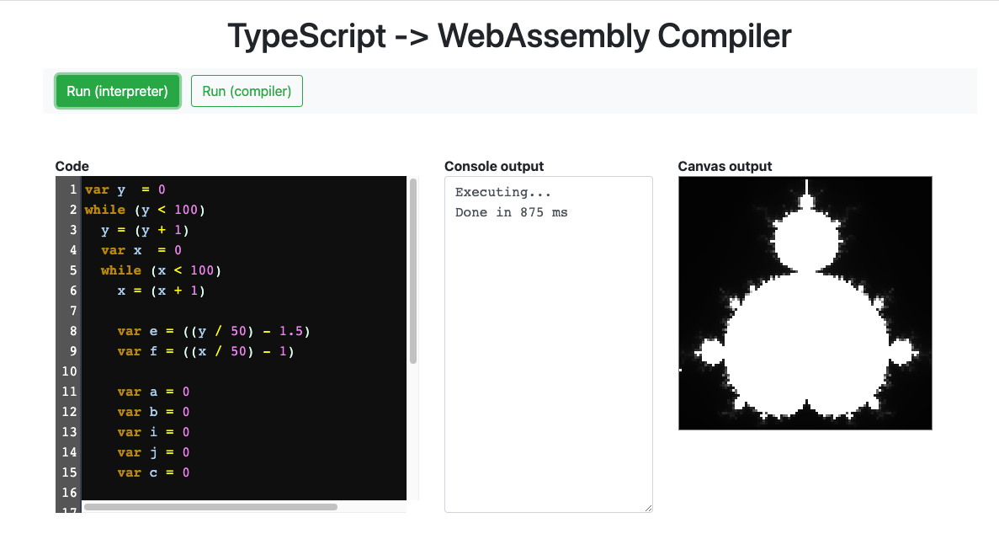
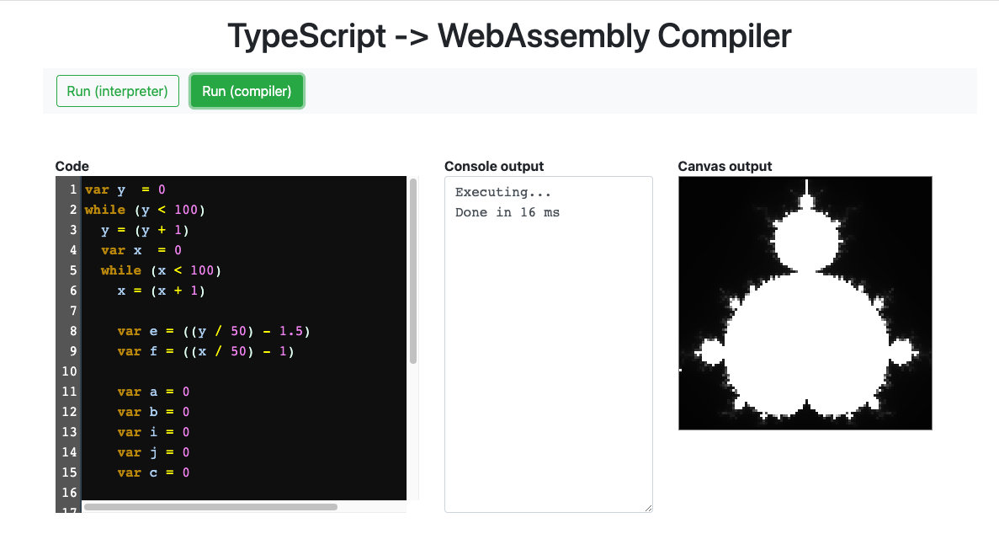

# TypeScript Compiler for WebAssembly

> Программа на `TypeScript`, компилирующая переданную строку "вымышленного" кода (по умолчанию - реализацию [множества Мандельброта](https://ru.wikipedia.org/wiki/%D0%9C%D0%BD%D0%BE%D0%B6%D0%B5%D1%81%D1%82%D0%B2%D0%BE_%D0%9C%D0%B0%D0%BD%D0%B4%D0%B5%D0%BB%D1%8C%D0%B1%D1%80%D0%BE%D1%82%D0%B0)) в `wasm` и выполняющая его рендеринг - отрисовку на холсте (`canvas`). Имеется возможность рендеринга преобразованного [`AST`](https://ru.wikipedia.org/wiki/%D0%90%D0%B1%D1%81%D1%82%D1%80%D0%B0%D0%BA%D1%82%D0%BD%D0%BE%D0%B5_%D1%81%D0%B8%D0%BD%D1%82%D0%B0%D0%BA%D1%81%D0%B8%D1%87%D0%B5%D1%81%D0%BA%D0%BE%D0%B5_%D0%B4%D0%B5%D1%80%D0%B5%D0%B2%D0%BE) без его компиляции в `wasm`.

---

[Источник вдохновения](https://github.com/ColinEberhardt/chasm)

[Онлайн демо](https://stackblitz.com/edit/typescript-cmumxh)

---

__Локальный запуск проекта в режиме для разработки__

```bash
git clone https://github.com/harryheman/ts-wasm-compiler.git

cd ts-wasm-compiler

yarn
yarn dev
```

---

__Рендеринг преобразованного `AST`__

Кнопка `Run (interpreter)`:



---

__Рендеринг `wasm`__

Кнопка `Run (compiler)`:



_Обратите внимание_ на скорость рендеринга (вот для чего нужен `WebAssembly`).
